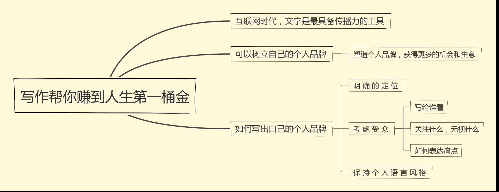

#### 为什么写作能帮你赚第一桶金

准备：笔记本 写作训练营必读书籍 多练习

> part1 互联网时代，文字成为传播不可或缺的力量

微信公众号 回复 ‘奔三’ ‘创业’
‘奔三’的文字是戳心的
‘创业’的受众较小

> part2 写作可以树立个人品牌

案例：一个男生小莹喜欢摄影 绘画，将绘画和文字发在自己的公众号中，无心插柳结果被诗词大会发现，找到他，从此名声大噪。
案例：叶小鱼，公众号的文案和书，收入来源就是讲授的课程和书。已经是文案领域有一定名气的老师了，它打造的就是在文案这个垂直领域的品牌，这个身份给了他课程的收入以及文案的外单。

把自己的长板塑造出来。塑造成能够囊括更多受众的，有比较有垂直方向的领域的专家。
会写文案的人 会写爆款文案的人是这个市场最稀缺的资源。
塑造个人品牌，通过这个品牌，去获得更多的机会和生意，而不仅是把这个公众号做得多大多大，而成为第二个咪蒙，这些都不现实。

> part3 如何写出自己的个人品牌

明确定位：
技能：it界 计算机 写代码
优点：心思细腻，注意观察对方的肢体动作并了解到对方的心情，爱学习，求知欲，为人和善
最爱做又不觉得累的事 ：喜欢体验不同的事物/领域等，寻求知识的广度，不仅是工作方面的，如：体验弹琴，运动有攀岩，潜水等。有机会喜欢去体验的，但是有的也还没有实现
老板雇佣你做什么：写代码

打造自个人品牌的原则：
1. 囊括尽量多的人群，哪怕在垂直领域，也要在哪个领域的人群要足够多
2. 尽量在这个领域给自己一个特别的标签
举例：擅长仙人掌的养殖。可以写 白领的绿植养殖，而不只是仙人掌 这样的题材
举例：只是漫画一般的简笔画可以是 ： 漫画界文笔最好的段子手
it界最躁动不安 不安现状的梦想家

站在考虑受众的角度去思考，才可能得到受众的喜欢，才可能获得社交/尊重/和自我实现
我写给谁看？
那个谁关注什么，渴求什么，无视什么？
我怎么表达痛点，他们才能感同身受？
举例：写烘培，写容易看懂 容易学会 看起来好吃的，由于针对的是小白，还要说用什么工具，不是说不买工具就可以烘焙的，还可以写怎么提升亲子关系，多数来说烘焙的都是妈妈，还关注孩子 关注健康 关注如何赚钱，就可以去写这些。让他们在看你的文章的同时，最终能实现自身的价值。在这个互联网的时代，你要先成就他人，最终才能成就你自己。如果不考虑受众文章只是自己看，通常只能是自娱自乐，自说自话。

保持个人语言风格：
理性表达/情绪化/
咪蒙的风格：活泼的，爱说段子的。如果有一天风格变的严肃了，大家不会觉得咪蒙变了，而是觉得这篇文章不是咪蒙写的。
举例：阿和是清华的理工男：阿和有话说 条理清晰

可以：添加口头禅，常用的语言表达风格。形成自己的个人语言风格

作业：
痛点是什么？ 大多数人没时间考虑美好的生活，可是我们内心又都向往美好生活！当下人们对感情都有诸多困惑，想了解如何得到一份真挚的感情

写作的定位方向3个：
it界人士的诗和远方：所有计算机领域的受众人群
小白领的诗和远方
小白领的沟通/感情/表达

5个选题，要写什么：
1 程序员脑海里除了代码都在想什么？！（写程序时脑海中的天马行空）

2 白领：工作之余，除了游戏和摊在床，我们还能干什么？（人生思考方向）

3 程序员：改变程序员形象，媛猿有责！ 媛媛 猿猿穿搭/面试穿搭等等。

4 我们要富，可是我们的外财在哪？

5 我有一份真挚的感情想要送给你，请让我知道你在哪

关于写作这件事，在大学期间也喜欢抄录一些文字，这也得感谢中学期间语文老师的教导。那个时候只觉得学业繁重，而如今时间充足不许再为了‘完成任务’而做事情的时候，发现自己内心是喜欢做这些事的。在大学毕业之后就一直想着要开始的，可是不知道该如何下笔，在学校写的文字无非都是老师要求的作文或者日记。毕业之后是自己想要去写写属于自己的文字，表述自己这一类人的内心，也可以说创立一个自己的个人品牌。期间也不乏看过一些很不错的文章，感受就是人家的经历好丰富呀，文笔很好呀，可是我都没有呀，所以我也写不出来呀。但是
